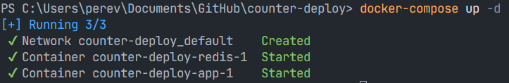
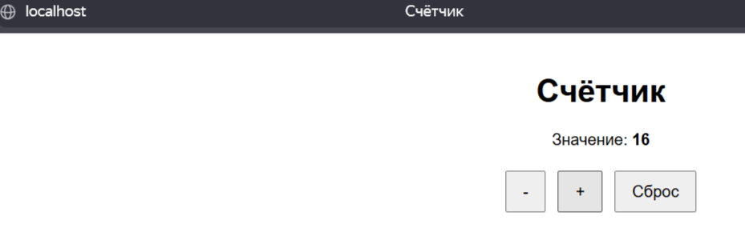
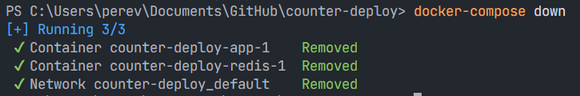

# counter-deploy

### **Локальное развертываение**
- Запуск и билд: `docker-compose up -d`

- Доступ `localhost:80`

- Остановить контейнер `docker-compose down`

### **Удаленное развертывание на сервер**

1. Скопировать пару ssh ключей преподавателя в директорию .ssh у пользователя.
2. Для подключения к серверу использовать команду: `ssh -i ~/.ssh/students root@5.101.51.5`, где students название приватного ключа.
3. Перейти в папку к ssh ключам: `cd ~/.ssh`
4. Команда для генерации ssh: `ssh-keygen -t rsa -b 4096 -f PereverzaE -C "pereverza.egor@gmail.com"`
5. Скопировать ssh ключи к себе на ПК.
6. Выполнить команду, PereverzaE заменить на название ключа `cat PereverzaE.pub | ssh root@5.101.51.5 "mkdir -p ~/.ssh && cat >> ~/.ssh/authorized_keys"`
Требует пароль. Другие команды не работают. Нет GitHub action